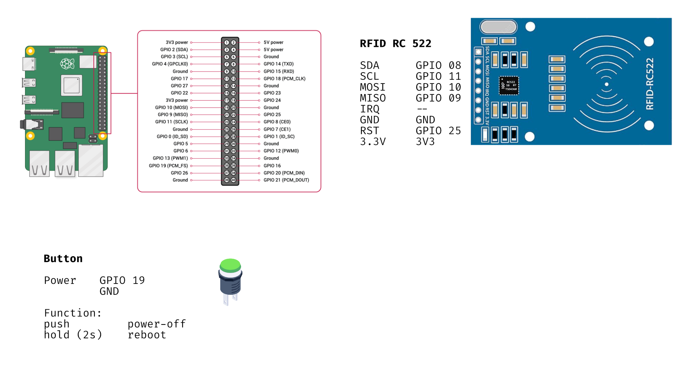

# RFID service Table

Version #2 of the RFID Service Table Controlled by a Raspberry PI

## Hardware

- Raspberry Pi (3 upwards)
- RC 522 RFID Reader
- 13,56 MhZ RFID Tags
- Adafruit NeoPixel Ring 32 WS2812 5050 RGB LEDs

## Setup Guide

Connect Buttons, Lightring and RFID Reader

Install current version of Raspberry OS and run updates

    sudo apt update
    sudo apt upgrade

Setup Neopixel libraries for the Lightring

    sudo pip3 install rpi_ws281x adafruit-circuitpython-neopixel
    sudo python3 -m pip install --force-reinstall adafruit-blinka

Install dependencies from requirements.txt

    sudo pip3 install requirements.txt

Enable SPI in raspi-config

    sudo raspi-config

Clone this repository into the home directory of the PI

    /home/pi/rfid_service_table

Run the table_reader.py script

    sudo python3 table_reader.py

## How to Input Media

1. Put all video and audio files into the media folder

   /home/pi/rfid_service_table/media

2. Add files and corresponding RFID Tag IDs into the [media list](media/media_list.py)

If the RFID Tag IDs are unclear, run this [script](util/simple_tag_reader.py) and swipe the card across the reader

## Running the script on startup

To run the script when the py is started, add it to .bashrc

Edit .bashrc with nano

    sudo nano /home/pi/.bashrc

At the end of the file add:

    echo Running at boot
    python3 /home/pi/rfid_service_table/table_reader.py

See [link](https://www.dexterindustries.com/howto/run-a-program-on-your-raspberry-pi-at-startup/) for more detailed instruction
